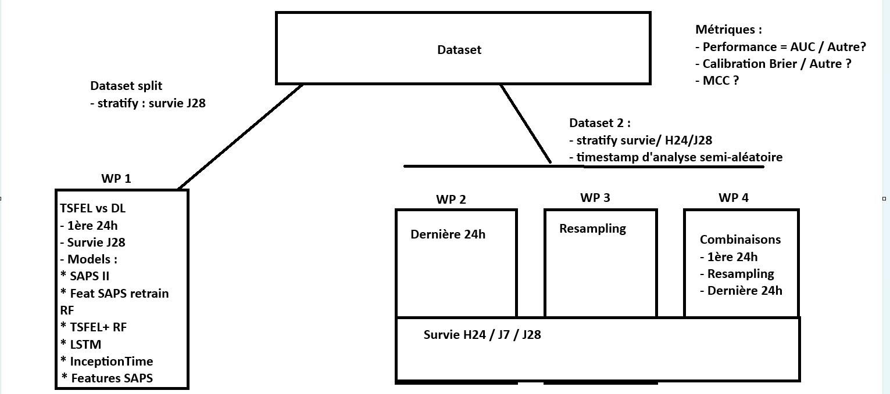

# ICU Mortality Prediction Model Comparison Pipeline



## Project Overview

This repository implements a **rigorous machine-learning pipeline** for predicting ICU patient mortality using longitudinal physiological time-series data. The pipeline compares multiple model architectures (deep learning, tree-based, linear, and clinical scores) across a comprehensive grid of experimental configurations, including different feature sets, windowing strategies, class-balancing methods, and hyperparameter optimization strategies.

The core of the project is a **sequential, fully-logged pipeline** (`Models_Comparison_Pipeline_sequential_journalisation.py`) that orchestrates the entire experiment lifecycle: data loading, preprocessing, cross-validation, model training, evaluation, calibration analysis, holdout testing, SHAP explanation, and statistical comparison.

---

## Architecture

```
Projet Stage M2/
│
├── README.md                           # This file
├── requirements.txt                    # Python dependencies
├── static/
│   └── overview.png                    # Pipeline overview diagram
│
├── WorkPackages_WorkFlow/              # Main workflow directory
│   ├── Models_Comparison_Pipeline_     # ★ CORE: Sequential pipeline (~2700 lines)
│   │   └── sequential_journalisation.py
│   ├── pipeline_logs/                  # Auto-generated log files per run
│   ├── json/                           # Experiment result caches
│   ├── inputs/                         # Experiment input configurations
│   ├── outputs/                        # Experiment outputs
│   ├── comparison_figs/                # Generated comparison figures
│   ├── models/                         # Trained model checkpoints
│   └── queries/                        # SQL queries (if applicable)
│
├── utilitaries/                        # Utility modules
│   ├── config_utils.py                 # Configuration constants (MODELS, MODES, FEAT, etc.)
│   ├── path_utils.py                   # Experiment class: path management & naming
│   ├── sequential_utils.py             # PipelineConfig dataclass & factory
│   ├── shared_ui.py                    # Marimo UI widget factories for sidebar
│   ├── preprocessing_utils.py          # Fold preprocessing (TSFEL & time modes)
│   ├── resampling_utils.py             # Resampling helpers (Lomax, fixed-point)
│   ├── training_utils.py               # Model fitting, calibration wrappers & learning curves
│   ├── evaluate_utils.py               # Fold evaluation (Inception, LSTM, Transformer, TSFEL)
│   ├── features_extraction_utils.py    # TSFEL time-series feature extraction & Boruta selection
│   ├── static_features_utils.py        # Static feature encoding, TableOne, categorical handling
│   ├── show_fig_utils.py               # Visualization: ROC, PRC, calibration, KDE, etc.
│   ├── postprocessing_utils.py         # Bootstrap CI, SHAP explanation, fixed-threshold metrics
│   ├── create_merged_dataset.py        # Static + dynamic data merging
│   ├── extract_data_utils.py           # Data extraction, duplicate removal, column constants
│   ├── timestamp_sampling_utils.py     # Timestamp sampling & label preparation
│   ├── resampling_and_window_choice_pipeline.py  # Windowing/resampling pipeline entry point
│   ├── optuna/                         # Optuna hyperparameter optimization
│   │   ├── optuna_utils.py             # Common Optuna utilities (storage, metric extraction)
│   │   ├── optuna_inception_utils.py   # InceptionTime hyperparameter search
│   │   ├── optuna_lstm_utils.py        # LSTM hyperparameter search
│   │   ├── optuna_vanilla_utils.py     # VanillaTransformer hyperparameter search
│   │   ├── optuna_xgb_utils.py         # XGBoost hyperparameter search (anti-overfit)
│   │   ├── optuna_rf_utils.py          # RandomForest hyperparameter search
│   │   └── optuna_svc_utils.py         # SVC hyperparameter search
│   ├── models/                         # Deep learning model implementations
│   │   ├── inceptionTimeModified.py    # InceptionTime CNN architecture
│   │   ├── lstmTimeModified.py         # LSTM RNN architecture
│   │   └── vanillaTransformerModified.py  # Vanilla Transformer (TST) architecture
│   └── tests/                          # Utility tests
│       └── clustering_utils.py         # Hierarchical clustering with Plotly visualizations
│
└── .gitignore
```

---

## Core Pipeline: `Models_Comparison_Pipeline_sequential_journalisation.py`

This ~2700-line script is the **central orchestrator** of the entire project. It runs a grid of experiments sequentially, each defined by a unique combination of:

- **Model** (VanillaTransformer, InceptionTime, LSTM, XGBoost, RandomForest, SVC, Lasso Logistic Regression, IGS2 clinical score)
- **Feature set** (IGS2, Commonly Used, Commonly Used Without PMSI, All, All Without PMSI, Custom)
- **Windowing mode** (24h start of ICU stay, 24h end of ICU stay, random Lomax resampling)
- **Target** (28-day mortality, 24h mortality, 7-day mortality, 3-month mortality)
- **Balancing method** (None, DownSampling 50-50, UpSampling 50-50)
- **Stratification** (target-based, 24h-then-28d)
- **Optuna** (enabled/disabled for hyperparameter tuning)

### Pipeline Execution Flow

```
┌─────────────────────────────────────────────────────────────────────┐
│  1. LOGGING SETUP                                                   │
│     - Dual output (terminal + log file) with stage tracking         │
│     - Crash context injection for debugging                         │
│     - Python hash seed + CUDA deterministic mode                    │
└─────────────────────────────────────────────────────────────────────┘
                                ↓
┌─────────────────────────────────────────────────────────────────────┐
│  2. EXPERIMENT GRID ITERATION                                       │
│     - For each (mode, target, stratification, feature, model,       │
│       balancing, optuna) combination:                               │
└─────────────────────────────────────────────────────────────────────┘
                                ↓
┌─────────────────────────────────────────────────────────────────────┐
│  3. CONFIGURATION BUILD                                             │
│     - create_pipeline_config() assembles PipelineConfig             │
│     - Determines calibration strategy (prior/temperature/Platt)     │
│     - Sets TSFEL extraction & class-weight options                  │
└─────────────────────────────────────────────────────────────────────┘
                                ↓
┌─────────────────────────────────────────────────────────────────────┐
│  4. DATA LOADING & MERGING                                          │
│     - Load merged_static_ano_and_dynamic.parquet                    │
│     - Remove duplicates (prio_first / prio_last)                    │
│     - Prepare survival labels (isDeceased_lt_28d, etc.)             │
│     - Filter delta_hour >= 0                                        │
└─────────────────────────────────────────────────────────────────────┘
                                ↓
┌─────────────────────────────────────────────────────────────────────┐
│  5. DATASET PREPARATION & CLEANING                                  │
│     - Apply windowing mode (24h window / resampling)                │
│     - Drop score columns, leakage columns, unused columns           │
│     - Select feature subset (IGS2 / Commonly Used / All / Custom)   │
│     - One-hot encode categorical features (admission_type, GHM,     │
│       entry mode, gender)                                           │
│     - TableOne baseline statistics (Mode Commonly Used)             │
│     - Filter patients by expected sequence length (window mode)     │
└─────────────────────────────────────────────────────────────────────┘
                                ↓
┌─────────────────────────────────────────────────────────────────────┐
│  6. INITIAL HOLDOUT SPLIT (80/20)                                   │
│     - StratifiedGroupKFold (5 splits, patient-level groups)         │
│     - First split: train_init (80%) / test_holdout (20%)            │
│     - For TSFEL: extract global TSFEL features per patient          │
│     - For score mode: extract IGS2/NEWS2 probabilities              │
└─────────────────────────────────────────────────────────────────────┘
                                ↓
┌─────────────────────────────────────────────────────────────────────┐
│  7. FOLD BUILDING (5-FOLD CROSS-VALIDATION)                         │
│     - StratifiedGroupKFold on train_init                            │
│     - For each fold:                                                │
│       · Correlation + zero-variance feature filtering               │
│       · Boruta feature selection (cross-fold, dynamic elbow)        │
│       · Feature trace tracking per fold as JSON                     │
│       · Class balancing (downsampling / upsampling)                 │
│       · StandardScaler fit on train, transform validation + holdout │
└─────────────────────────────────────────────────────────────────────┘
                                ↓
┌─────────────────────────────────────────────────────────────────────┐
│  8. OPTUNA HYPERPARAMETER SEARCH (Optional)                         │
│     - If RUN_OPTUNA and no saved config exists:                     │
│       · Run model-specific Optuna search on fold 0                  │
│       · Models: InceptionTime, LSTM, VanillaTransformer,            │
│         XGBoost, RandomForest, SVC                                  │
│       · Save best parameters to best_hyperparameters.json           │
└─────────────────────────────────────────────────────────────────────┘
                                ↓
┌─────────────────────────────────────────────────────────────────────┐
│  9. MODEL TRAINING WITH LEARNING CURVE                              │
│     - For each of 5 folds:                                          │
│       · Learning curve stages: 20%, 40%, 60%, 80%, 100% of data    │
│       · At 100%: save final model to disk                           │
│       · Calibration split (if enabled): 3-fold for calibration set  │
│       · Prior calibration for balanced TSFEL models                 │
│       · Temperature scaling for time-series models                  │
│       · Platt scaling for other models                              │
│     - Skip fold if model already exists on disk                     │
└─────────────────────────────────────────────────────────────────────┘
                                ↓
┌─────────────────────────────────────────────────────────────────────┐
│  10. CROSS-VALIDATION EVALUATION                                    │
│     - For each fold: load model, predict on validation set          │
│     - Collect per-fold: AUC, AUPRC, Brier, ICI, F1, MCC            │
│     - Pool out-of-fold (OOF) predictions across all 5 folds         │
│     - Compute global OOF metrics with mean +/- std                  │
└─────────────────────────────────────────────────────────────────────┘
                                ↓
┌─────────────────────────────────────────────────────────────────────┐
│  11. FIGURE GENERATION (OOF)                                        │
│     - ROC curve, PRC curve, Calibration curve (fixed bins)          │
│     - KDE distribution plot, F1-score evolution                     │
│     - Confusion matrix, Brier score evolution                       │
│     - Calibration per risk brackets                                 │
│     - Learning curve plot                                           │
│     - OOF vs Holdout calibration comparison                         │
└─────────────────────────────────────────────────────────────────────┘
                                ↓
┌─────────────────────────────────────────────────────────────────────┐
│  12. INDEPENDENT HOLDOUT EVALUATION                                 │
│     - Ensemble prediction: average of 5 fold models on holdout      │
│     - Bootstrap (2000 iterations) 95% CI for all metrics            │
│     - SHAP explanation (for TSFEL models, except SVC)               │
│     - Holdout figures: ROC, PRC, Calibration, KDE, etc.             │
│     - Train vs Holdout calibration comparison                       │
└─────────────────────────────────────────────────────────────────────┘
                                ↓
┌─────────────────────────────────────────────────────────────────────┐
│  13. LASSO PATH (for Lasso models)                                  │
│     - Warm-start L1 regularization path with multiprocessing        │
│     - Coefficient evolution plots per fold                          │
└─────────────────────────────────────────────────────────────────────┘
                                ↓
┌─────────────────────────────────────────────────────────────────────┐
│  14. MODEL COMPARISON REPORT (Optional)                             │
│     - If RUN_COMPARISON: load all available models                  │
│     - Generate comparative report with collective ROC/PRC/Calib     │
│     - Subgroup analysis: Age, Admission Type, ICU GHM               │
│     - Per-subgroup bootstrap holdout metrics                        │
└─────────────────────────────────────────────────────────────────────┘
                                ↓
┌─────────────────────────────────────────────────────────────────────┐
│  15. SAVE RESULTS                                                    │
│     - all_res.joblib: complete result dictionary                    │
│     - Per-experiment output directory with figures & models         │
└─────────────────────────────────────────────────────────────────────┘
```

---

## Supported Models

| Model | Type | Extraction | Optuna Support | Calibration |
|-------|------|------------|----------------|-------------|
| **VanillaTransformerModified** | Deep Learning (Transformer) | time (3D sequences) | Yes | Temperature Scaling |
| **InceptionTimeModified** | Deep Learning (CNN) | time (3D sequences) | Yes | Temperature Scaling |
| **LstmTimeModified** | Deep Learning (RNN) | time (3D sequences) | Yes | Temperature Scaling |
| **XGBoost TSFEL** | Gradient Boosting | TSFEL (tabular) | Yes | Platt / Prior |
| **RandomForest TSFEL** | Ensemble Trees | TSFEL (tabular) | Yes | Platt / Prior |
| **RandomForest Imbalanced TSFEL** | Ensemble Trees (Balanced) | TSFEL (tabular) | No | Platt / Prior |
| **SVC TSFEL** | Support Vector Machine | TSFEL (tabular) | Yes | Platt / Prior |
| **Logistic Regression Lasso TSFEL** | Linear (L1) | TSFEL (tabular) | No (inner CV) | Platt / Prior |
| **IGS2** | Clinical Score | score | N/A | None |

### Extraction Types

- **`time`**: Raw physiological time-series (3D tensor: `[patients, time_steps, features]`). Used by deep learning models (VanillaTransformer, InceptionTime, LSTM).
- **`TSFEL`**: Tabular features extracted via [TSFEL](https://tsfel.readthedocs.io/) (Time Series Feature Extraction Library) + static features. Used by classical ML models.
- **`score`**: Clinical score probability (e.g., IGS2). Used for baseline comparison.

---

## Feature Selection Modes

| Mode | Description |
|------|-------------|
| **Mode IGS2** | Features defined by IGS2 scoring system |
| **Mode Commonly Used Without pmsi** | 34 clinically common features, no PMSI/admin codes |
| **Mode Commonly Used** | Commonly used + PMSI columns (`hx_*`, `icu_*`) |
| **Mode All** | All available features after cleaning |
| **Mode All Without pmsi** | All features except `hx_*` and `icu_*` prefixes |
| **Mode Custom** | User-selected feature subset |

### Dropped Column Categories

- **Score columns**: `NEWS`, `NEWS2`, `sapsii`, `sapsii_prob` (to avoid score leakage)
- **Discarded**: `endotracheal_tube`, `tracheo`, `ecmo_all`, `prone`, etc.
- **Leakage**: `encounterId`, `delta_hour`, `target_col`, `deces_datediff_days`, `los`, etc.
- **Unused ICU**: `icu_actes`, `icu_mode_sortie`, `hosp_primaryDiagnosis`, etc.

### TSFEL Feature Explainability Scores

The pipeline assigns explainability scores to TSFEL feature families in 6 tiers:

| Tier | Score Range | Feature Families |
|------|-------------|-----------------|
| **1: Highly explainable** | 90-100 | max, min, mean, median, peak-to-peak, area, ecdf percentile |
| **2: Moderately explainable** | 70-85 | std, variance, rms, energy, zero-crossing, IQR, slopes |
| **3: Poorly explainable** | 50-65 | skewness, kurtosis, autocorrelation, spectral centroid |
| **4: Abstract / Informational** | 30-45 | entropy, Lempel-Ziv complexity, multiscale entropy |
| **5: Purely spectral** | 10-25 | spectral roll-off/roll-on/spread/slope/skewness/kurtosis |
| **6: Wavelets** | 0-5 | wavelet std/variance/energy/entropy |

---

## Windowing / Resampling Modes

| Mode | Description |
|------|-------------|
| **`24h_debut_rea_no-fill`** | 24-hour window from ICU admission start, no interpolation |
| **`24h_fin_rea_no-fill`** | 24-hour window from ICU discharge, no interpolation |
| **`resampling_x_points_alea_lomax_prio_24h_no-fill`** | Random Lomax-distributed resampling prioritizing first 24h |
| **`resampling_X_points`** | Fixed-point resampling to median ICU stay length |

---

## Target Variables

| Target | Column | Description |
|--------|--------|-------------|
| **Survie a 24 heures** | `isDeceased_lt_24h` | Death within 24 hours |
| **Survie a 7 jours** | `isDeceased_lt_7d` | Death within 7 days |
| **Survie a 28 jours** | `isDeceased_lt_28d` | Death within 28 days |
| **Survie a 3 mois** | `isDeceased_lt_3m` | Death within 3 months |

---

## Cross-Validation Strategy

The pipeline uses a **nested, patient-level stratified group cross-validation**:

1. **Initial 80/20 Holdout Split**: `StratifiedGroupKFold(n_splits=5)` on the full dataset. The first split creates:
   - `train_init` (80%): Used for cross-validation training
   - `test_holdout` (20%): Completely independent evaluation set

2. **5-Fold CV on Training Set**: `StratifiedGroupKFold(n_splits=5, shuffle=True, random_state=42)` on `train_init`:
   - Groups = patient IDs (`encounterId`) to prevent data leakage between folds
   - Stratified by target label to maintain class balance
   - Each fold produces one trained model

3. **Out-of-Fold (OOF) Pooling**: Each patient appears in exactly one validation fold. Predictions are pooled across all 5 folds for unbiased metric estimation.

4. **Holdout Ensemble**: Final predictions on the 20% holdout are obtained by averaging the 5 fold models' predictions.

---

## Boruta Feature Selection (Cross-Fold with Dynamic Threshold)

The Boruta feature selection uses a **cross-fold approach with dynamic threshold estimation**:

**Phase 1: Per-Fold Boruta Collection**
- Run Boruta independently on each of the 5 cross-validation folds
- Collect the list of selected features from each fold

**Phase 1.5: Elbow Analysis (Dynamic Threshold)**
- Compute the frequency with which each feature appears across all folds
- Plot the frequency curve (threshold vs. remaining features)
- Estimate the optimal frequency threshold using the **elbow method** (maximum distance to the chord between first and last points)
- The `kneed` library is used when available, with a manual fallback otherwise
- This threshold is **data-dependent** and varies per experiment

**Phase 2: Unified Feature Set**
- Retain only features that appear at or above the elbow-determined frequency threshold
- Save the unified feature set as `boruta_crossfold_features.npy`
- Save the elbow curve figure as `boruta_frequency_elbow.png`

**Traceability**
- Each fold saves a `feature_trace_fold_*.json` file tracking:
  - Initial feature count
  - Features after correlation/variance filtering
  - Features after Boruta cross-fold filtering
  - Final feature set

---

## Calibration Strategies

| Strategy | When Applied | Description |
|----------|-------------|-------------|
| **Prior Correction** | Balancing + TSFEL models | Analytical correction: `beta = (n_malades_avant * n_sains_apres) / (n_sains_avant * n_malades_apres)` |
| **Temperature Scaling** | Time-series models (DL) | Single scalar learned on calibration set via binary cross-entropy |
| **Platt Scaling** | Other models | Logistic regression on model outputs, fitted on calibration set |

When calibration is enabled without balancing, the training fold is further split (3-fold SGKF) to create a held-out calibration set.

### Fixed-Bin Calibration

Calibration curves use **fixed 10% risk brackets** (0.05, 0.15, ..., 0.95) for consistent comparison across models and datasets. This aligns the calibration curve visualization with the Brier score, ICI, and risk bracket analysis.

---

## Evaluation Metrics

### Discrimination

- **AUC-ROC**: Area Under the Receiver Operating Characteristic Curve
- **AUPRC**: Area Under the Precision-Recall Curve
- **F1-Score**: At optimal threshold (OOF) or fixed threshold (holdout)
- **MCC**: Matthews Correlation Coefficient

### Calibration

- **Brier Score**: Mean squared difference between predicted probabilities and outcomes
- **ICI**: Integrated Calibration Index
- **Calibration Intercept & Slope**: From logistic regression of logits on predicted probabilities
- **E90, EMax**: 90th percentile and maximum calibration errors in risk brackets

### Distribution

- **Non-overlap Area**: Between alive/deceased probability distributions
- **Asymmetric Uncertainty**: Distribution asymmetry measure
- **Mean Risk Difference**: Average predicted probability gap between classes

### Statistical Confidence

- **Bootstrap 95% CI**: 2000 bootstrap iterations on holdout metrics

---

## Generated Artifacts

Each experiment produces an output directory structured as:

```
inputs/<duplication_mode>/<target>/<windowing>/<features>/<model>/
├── model_0.pt / model_0.joblib        # Fold 0 trained model
├── model_1.pt / model_1.joblib        # Fold 1 trained model
├── ...
├── best_hyperparameters.json           # Optuna best params (if used)
├── all_res.joblib                      # Complete result dictionary
├── learning_curve.png                  # Learning curve plot
├── roc_curve.png                       # ROC curve
├── prc_curve.png                       # Precision-Recall curve
├── calibration_curve.png               # Calibration curve (fixed bins)
├── kde_plot.png                        # KDE distribution plot
├── f1_score_evolution.png             # F1-score vs threshold
├── confusion_matrix.png               # Confusion matrix
├── brier_evolution.png                # Brier score evolution
├── calibration_per_risk.png           # Calibration by risk bracket
├── tableone_static_features.csv       # TableOne baseline statistics
├── tableone_static_features.html      # TableOne HTML report
├── L1_Log_path_fold_*.png             # Lasso coefficient paths (if Lasso)
├── tsfel_boruta/
│   └── train/
│       └── <seed>/
│           ├── feature_trace_fold_*.json  # Feature selection trace
│           ├── train_filtered.parquet     # Cached filtered train data
│           └── test_filtered.parquet      # Cached filtered test data
└── holdout/
    ├── roc_curve.png
    ├── prc_curve.png
    ├── calibration_curve.png
    ├── calibration_oof_vs_holdout.png
    ├── shap_summary.png               # SHAP beeswarm (TSFEL models)
    └── shap_top10.png                 # SHAP top-10 features
```

---

## Configuration Modules

### `config_utils.py` - Central Configuration Registry

Defines all available options as immutable configuration objects:

- **`MODES`**: Windowing/resampling configurations
- **`CLEAN`**: Data cleaning strategies
- **`Y`**: Target variable configurations
- **`BALANCE`**: Class balancing methods
- **`POPULATION`**: Population filtering options
- **`MODELS`**: Model definitions with extraction type and calibration info
- **`SCORE`**: Clinical score configurations
- **`FEAT`**: Feature set definitions with keep/drop lists

### `path_utils.py` - `Experiment` Class

Manages all file paths for a given experiment configuration. Key methods:

- `get_model_path()`: Path to a trained model file
- `get_output_path()`: Output directory for figures and results
- `get_tsfel_parquet_path()`: Cached TSFEL feature path
- `get_lasso_path()`: Lasso data path
- `get_comparison_path()`: Comparison report directory
- `get_tsfel_boruta()`: Boruta filtered data path
- `get_boruta_crossfold_path()`: Boruta cross-fold cache path
- `get_corr_threshold_path()`: Correlation threshold cache path

### `sequential_utils.py` - `PipelineConfig` Factory

Returns a frozen `PipelineConfig` dataclass with all sub-configurations, including auto-determined calibration strategy.

### `shared_ui.py` - Marimo UI Widget Factories

Provides functions to build the configuration sidebar for marimo-based pipeline notebooks, including dropdowns, toggles, and input widgets for windowing, population, model, feature, and balancing settings.

---

## Utility Module Details

### `preprocessing_utils.py`

- **`scaling()`**: Scales continuous numerical features using `StandardScaler`, excluding binary columns (0/1) and boolean features. Fitted exclusively on training data.
- **`build_sequences()`**: Converts patient observations into fixed-length 3D sequences with alphabetically sorted features for stable ordering.
- **`downsample_train_patients()`**: Custom patient-level downsampling that preserves all positive-class patients while sampling from the negative class to match balance.
- **`equilibrer_dataset_tabulaire()`**: Balances a tabular DataFrame using multiple strategies.
- **`process_tsfel_fold()`**: Prepares one fold for TSFEL-based models (correlation/variance filtering, Boruta, balancing, scaling, feature trace JSON).
- **`process_time_fold()`**: Prepares one fold for time-series models (sequence building, padding/truncation, balancing).

### `training_utils.py`

- **`TemperatureScaledEstimator`**: Wraps any estimator with PyTorch temperature calibration.
- **`PriorCorrectionWrapper`**: Wraps any estimator with analytical prior-probability correction.
- **`fit_model_by_name()`**: Dispatches training to the appropriate model (VanillaTransformer, InceptionTime, LSTM, XGBoost, RandomForest, SVC, Lasso).
- **`get_learning_curve_chunk()`**: Stratified group-aware sampling for learning curve stages (20%, 40%, 60%, 80%, 100%).
- **`apply_model_calibration()`**: Temperature scaling or Platt scaling on a held-out calibration set.
- **`get_root_estimator()`**: Recursively unwraps known wrappers.

### `evaluate_utils.py`

- **`evaluate_vt_fold()`**: Load VanillaTransformer model, predict probabilities.
- **`evaluate_inception_fold()`**: Load InceptionTime model, predict probabilities.
- **`evaluate_lstm_fold()`**: Load LSTM model, predict probabilities.
- **`evaluate_tsfel_fold()`**: Load TSFEL model (joblib), predict with calibration.
- **`align_tsfel_features()`**: Align TSFEL feature columns with model-expected schema.

### `features_extraction_utils.py`

- **`extract_tsfel_per_patient()`**: Extracts TSFEL features from time-series data (statistical, temporal, spectral) and joins with static features.
- **`filtrage_corr_var()`**: Correlation and variance filtering with static feature protection.
- **`estimate_correlation_threshold()`**: Elbow analysis for correlation threshold estimation.
- **`resolve_boruta_crossfold_features()`**: Cross-fold Boruta with dynamic elbow threshold.
- **Explainability scores**: Tiered scoring system for TSFEL feature families.

### `static_features_utils.py`

- **`encode_categorical_features()`**: One-hot encoding for `admission_type`, `icu_ghm`, `icu_mode_entree`, `gender`.
- **`build_static_feature_list()`**: Identifies static vs. temporal features.
- **`build_tableone()`**: Generates TableOne cohort statistics with continuous/categorical sections.

### `show_fig_utils.py`

Comprehensive visualization suite: ROC, PRC, calibration curves (fixed bins), KDE, F1 evolution, confusion matrix, Brier score, risk brackets, learning curves, comparative reports, subgroup analysis, side-by-side figure comparison.

### `postprocessing_utils.py`

- **`bootstrap_holdout_metrics()`**: Bootstrap 95% CI (2000 iterations).
- **`shap_holdout_ensemble()`**: SHAP explanation with 5-model ensemble.
- **`f1_at_fixed_threshold()` / `mcc_at_fixed_threshold()`**: Metrics at OOF-determined threshold.

### `resampling_and_window_choice_pipeline.py`

- **`prepare_dataset_from_config()`**: Main entry point for windowing/resampling (fixed-window, Lomax random, fixed-point modes).

### `resampling_utils.py`

- **`generate_lomax_timestamps()`**: Generate Lomax-distributed resampling timestamps.
- **`resample_patient_to_fixed_points()`**: Fixed-point patient resampling.

### `timestamp_sampling_utils.py`

- **`prepare_labels()`**: Prepare survival target labels from death dates.

### `extract_data_utils.py`

- **`remove_duplicates()`**: Remove duplicate encounters with priority-based selection.
- Column constants (`ID_COL`, `TIME_COL`, `WINDOW_SIZE`).

### `optuna/` - Hyperparameter Optimization

Each model has a dedicated Optuna search with TPE sampler and median pruner:

| Module | Model | Search Space |
|--------|-------|-------------|
| `optuna_inception_utils.py` | InceptionTime | `out_channels`, `bottleneck_channels`, `num_blocks`, `kernel_sizes`, `batch_size`, `lr`, `weight_decay`, `clip_grad` |
| `optuna_lstm_utils.py` | LSTM | `hidden_size`, `num_layers`, `bidirectional`, `dropout`, `fc_units`, `layernorm`, `batch_size`, `lr`, `weight_decay`, `clip_grad` |
| `optuna_vanilla_utils.py` | VanillaTransformer | `d_model`, `nhead`, `num_layers`, `dim_feedforward`, `dropout`, `batch_size`, `lr`, `weight_decay`, `clip_grad` |
| `optuna_xgb_utils.py` | XGBoost | `n_estimators`, `learning_rate`, `max_depth`, `min_child_weight`, `gamma`, `subsample`, `colsample_bytree`, `reg_alpha`, `reg_lambda` |
| `optuna_rf_utils.py` | RandomForest | `n_estimators`, `max_depth`, `min_samples_split`, `min_samples_leaf`, `max_features`, `bootstrap`, `class_weight` |
| `optuna_svc_utils.py` | SVC | `C`, `gamma`, `kernel`, `class_weight` |

---

## Running the Pipeline

### Prerequisites

```bash
pip install torch numpy polars scikit-learn xgboost joblib matplotlib seaborn tsfel optuna shap boruta-py pywt tabulate imbalanced-learn
```

### Sequential Pipeline

```bash
cd WorkPackages_WorkFlow
python Models_Comparison_Pipeline_sequential_journalisation.py
```

### Configuration Flags

At the top of the sequential pipeline, toggle these flags:

```python
RUN_COMPARISON = False   # Generate model comparison reports
RUN_TRAINING = True      # Train models (skip if already trained)
RUN_LASSO = True         # Generate Lasso regularization paths
RUN_TEST = True          # Evaluate on independent holdout
POPULATION = "Tout"      # Population filter
SAVE_FIGURE = True       # Save figures to disk
TRANSPARENT = False      # Transparent background for figures
```

---

## Reproducibility

- **Fixed seed**: `SEED = 42` applied to `random`, `numpy`, `torch`, and `PYTHONHASHSEED`
- **Deterministic CUDA**: `torch.backends.cudnn.deterministic = True`, `benchmark = False`
- **Logging**: Every run produces a timestamped log file in `pipeline_logs/`
- **Cache**: TSFEL features, Boruta results, and Optuna results are cached to avoid recomputation
- **Skip existing**: Trained models are skipped if already present on disk

---

## Experiment Logging

Each pipeline run creates a log file: `pipeline_logs/pipeline_YYYYMMDD_HHMMSS_pidXXXX.log`

The log includes:

- Timestamped stage transitions
- Experiment configuration details
- Model training progress
- Evaluation metrics
- Full traceback on crash (with experiment context)

---

## Data Pipeline (External Repository)

The input data is prepared by a separate preprocessing pipeline:

- **Repository**: `/home/paquie.d/Preprocessing_pipeline/preprocessing-pipelines`
- **Input**: Raw ICU data from `data2/paquie.d/Datasets/`
- **Output**:
  - `df_static_ano_clean.parquet`: Cleaned static patient data
  - `df_dynamic_full_clean.parquet`: Cleaned longitudinal physiological data
  - `merged_static_ano_and_dynamic.parquet`: Merged dataset
  - `df_static_full_clean.parquet`: Static data without anomaly filtering

---

## Dependencies

| Package | Version | Purpose |
|---------|---------|---------|
| Python | >=3.10 | Runtime |
| PyTorch | >=2.0 | Deep learning models |
| NumPy | >=1.24 | Numerical operations |
| Polars | >=0.20 | Fast DataFrame operations |
| scikit-learn | >=1.3 | Classical ML, CV, metrics |
| XGBoost | >=2.0 | Gradient boosting |
| TSFEL | >=0.5 | Time-series feature extraction |
| Optuna | >=3.0 | Hyperparameter optimization |
| SHAP | >=0.44 | Model explanation |
| BorutaPy | >=0.4 | Feature selection |
| PyWavelets | >=1.4 | Wavelet transforms |
| Joblib | >=1.3 | Model serialization, parallelism |
| Matplotlib | >=3.7 | Figure generation |
| Seaborn | >=0.12 | Statistical visualization |
| imbalanced-learn | >=0.12 | Class balancing |
| tabulate | >=0.9 | Table formatting |
| tableone | >=0.9 | Baseline statistics tables |

---

## Workflow Packages (Modes)

The pipeline defines several preset experiment grids:

| Mode | Description |
|------|-------------|
| **`score`** | Baseline: IGS2 clinical score evaluation only |
| **`wp1`** | 24h-start window, 28-day mortality, all models, multiple feature sets, Optuna enabled |
| **`wp2`** | 24h-end window, all targets, all models, all balancing methods |
| **`wp3`** | Lomax resampling, all targets, all models, all balancing methods |
| **`test_imbalance`** | Imbalance impact study: Transformer + LSTM + XGBoost with balancing |
| **`test_robustesse`** | Robustness test: XGBoost only |
| **`SVC_LR`** | SVC + Lasso Logistic Regression benchmark |
| **`end_game`** | Full model comparison with all models and commonly used features |

---

## Project Structure Summary

```
Patient ICU Data (raw)
    ↓
[External Preprocessing Pipeline]
    ↓
merged_static_ano_and_dynamic.parquet
    ↓
[Models_Comparison_Pipeline_sequential_journalisation.py]
    ├── Data Loading & Label Preparation
    ├── Data Quality Filters (min 24h stay, valid SpO2, duplicate filtering)
    ├── Windowing / Resampling
    ├── Feature Selection & Cleaning
    ├── Initial 80/20 Holdout Split
    ├── 5-Fold Stratified Group CV
    │   ├── TSFEL Extraction (if needed)
    │   ├── Boruta Cross-Fold Feature Selection (dynamic elbow threshold)
    │   ├── Feature Trace JSON per fold
    │   ├── Class Balancing
    │   ├── StandardScaler
    │   ├── Optuna HP Search (optional)
    │   ├── Model Training (learning curve)
    │   ├── Calibration
    │   └── Fold Evaluation
    ├── OOF Pooling & Metrics
    ├── Figure Generation (including TableOne)
    ├── Independent Holdout Evaluation
    │   ├── Ensemble Prediction
    │   ├── Bootstrap 95% CI
    │   └── SHAP Explanation
    ├── Lasso Path (if Lasso model)
    └── Model Comparison Report (mean + std)
    ↓
all_res.joblib + figures + trained models
```

---

## Authors & Context

This project was developed as part of a Master's internship (Stage M2) at CHU Toulouse, focusing on ICU mortality prediction using machine learning models applied to longitudinal physiological data from the DYP-O ICU database.

**Repository**: `git@gitlab.chu-toulouse.fr:anesthesie-reanimation/dypo-icu/dynamic-modelisation.git`
